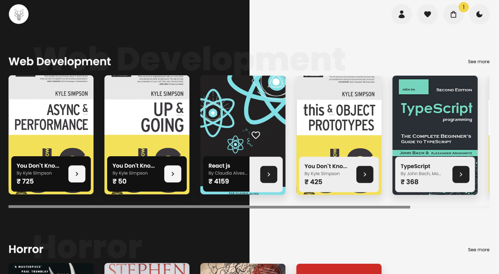

# Ecommerce Store



## Introduction

Welcome to the Ecommerce store for books, built with ReactJS!

Our store features a user-friendly interface and fast performance, thanks to the power of React. You can easily browse through our selection of books by genre, author, or price.

## Account Credentials

Here is a dummy account you can use to test all the features of this app

```
Username: test_user
Email: test@gmail.com
Password: test@1234
```

## Features

-   Communicates w/ custom Node JS [API Backend](https://github.com/imrhlrvndrn/alphacommerce-backend)
-   User Authentications
-   Filter books by Genre, Author or Price
-   Add/Remove books to cart
-   Add/Remove books from wishlists
-   Checkout books & place orders

## Built With

-   ReactJS
-   React Context API (State Management)
-   Sass
